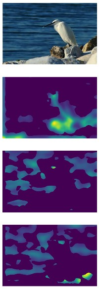

# Automated Aesthetic Analysis of Photographic Images

```
Aydın, Tunç Ozan, Aljoscha Smolic, and Markus Gross. 
"Automated aesthetic analysis of photographic images." 
IEEE transactions on visualization and computer graphics 21.1 (2014): 31-42.
```

Implementation using OpenCV.
Run pyramid.py to view 3 focus maps and compute metrics.

